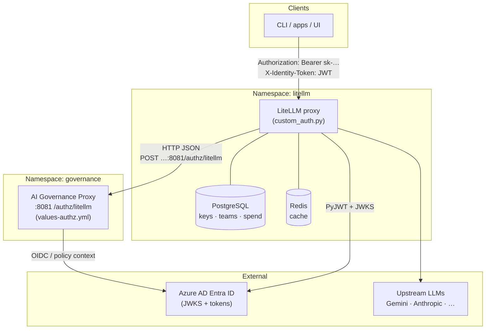
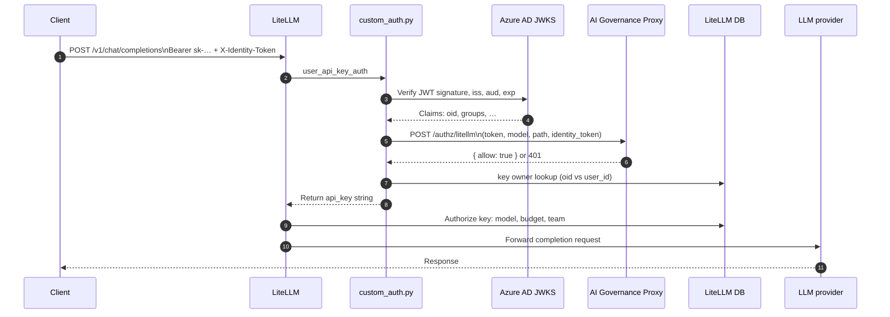
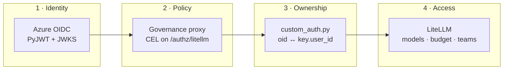
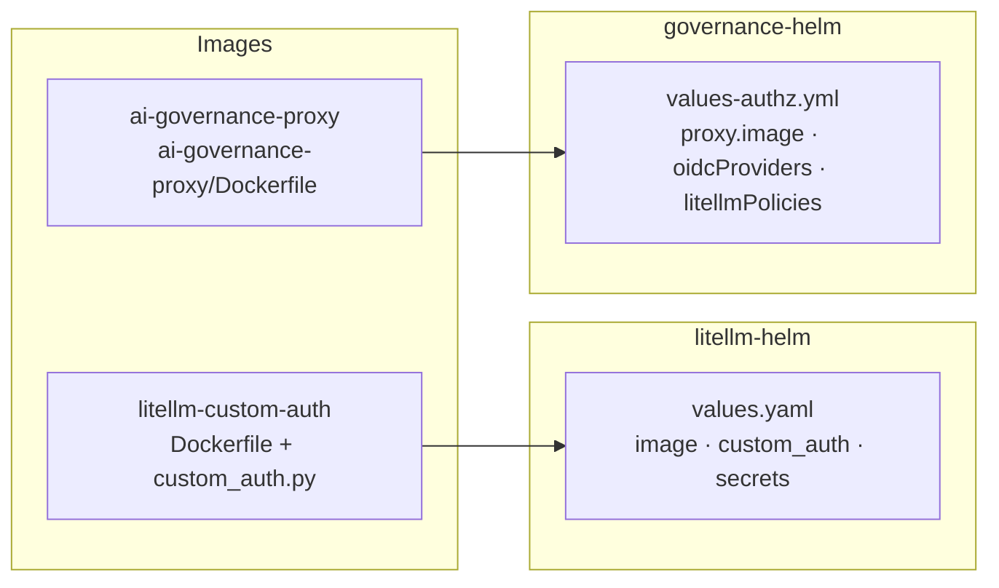
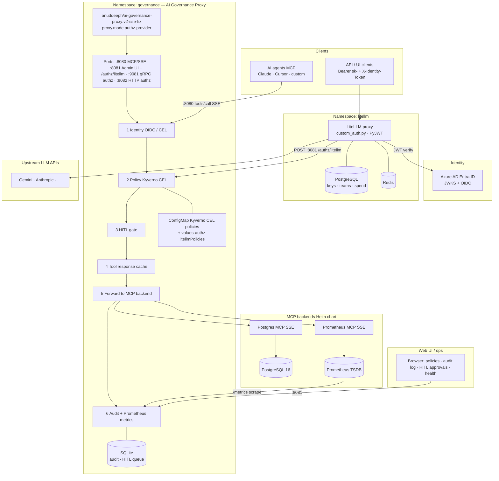

# Architecture Diagrams — LiteLLM + AI Governance Proxy + Azure AD

This demo wires **LiteLLM** (custom image with `custom_auth.py`) to an **AI Governance Proxy** deployed via **`governance-helm`** and **`values-authz.yml`**. Identity tokens are **Azure AD** JWTs; policy is **CEL** (Kyverno-flavored) evaluated in the proxy on **`POST /authz/litellm`**.

---

## 1. Kubernetes deployment topology

Pods run in two namespaces. External dependencies are Azure AD (JWKS + token issuance) and upstream LLM APIs.

**Service DNS (in-cluster default):** `http://ai-governance-proxy.governance.svc.cluster.local:8081` — override with env **`AI_GOVERNANCE_PROXY_URL`** on LiteLLM if needed.

---

## 2. Inference request path (sequence)

For **`/v1/chat/completions`** (and other inference prefixes), `custom_auth.py` validates the identity JWT, asks the governance proxy for allow/deny, then enforces **virtual key ownership** (`JWT oid` == key `user_id`) before LiteLLM continues.

---

## 3. Authorization layers (logical)

---

## 4. Helm and config touchpoints (no cluster Kyverno)

This stack does **not** install **Kyverno admission** or **`kyverno-authz-server`**; policy runs **inside** the governance proxy process.

---

## 5. Full stack — like `governance-helm/architecture.png` (LiteLLM + authz)

This matches the **Helm chart** poster layout: MCP agents on `:8080`, six-stage pipeline inside the proxy, SQLite + ConfigMap policies, Postgres/Prometheus MCP backends, Prometheus scrape, Web UI on `:8081`, **plus** the **LiteLLM** namespace and **`POST /authz/litellm`** from `custom_auth.py` and **Azure AD** for OIDC.

**PNG (high level, same content):** [`diagrams/05-full-stack-litellm-governance.png`](diagrams/05-full-stack-litellm-governance.png) — also copied as [`governance-helm/architecture-litellm-authz.png`](governance-helm/architecture-litellm-authz.png) next to the original [`governance-helm/architecture.png`](governance-helm/architecture.png).

---

## PNG exports (static assets)

Pre-rendered PNGs live in [`diagrams/`](diagrams/):

| Diagram | PNG |
|--------|-----|
| 1. Kubernetes topology | [`diagrams/01-topology.png`](diagrams/01-topology.png) |
| 2. Inference sequence | [`diagrams/02-sequence.png`](diagrams/02-sequence.png) |
| 3. Authorization layers | [`diagrams/03-layers.png`](diagrams/03-layers.png) |
| 4. Helm / images | [`diagrams/04-helm.png`](diagrams/04-helm.png) |
| 5. Full stack (Helm poster + LiteLLM + Azure) | [`diagrams/05-full-stack-litellm-governance.png`](diagrams/05-full-stack-litellm-governance.png) · [`governance-helm/architecture-litellm-authz.png`](governance-helm/architecture-litellm-authz.png) |

Source for re-rendering: matching `.mmd` files in the same folder (e.g. `npx @mermaid-js/mermaid-cli mmdc -i diagrams/01-topology.mmd -o diagrams/01-topology.png`, or [kroki.io](https://kroki.io) `POST /mermaid/png`).

---

## Rendering

- **GitHub / GitLab:** Mermaid renders in Markdown previews; PNGs above work anywhere (slides, docs, Confluence uploads).
- **VS Code / Cursor:** Use a Mermaid preview extension, or paste diagrams into [mermaid.live](https://mermaid.live).
