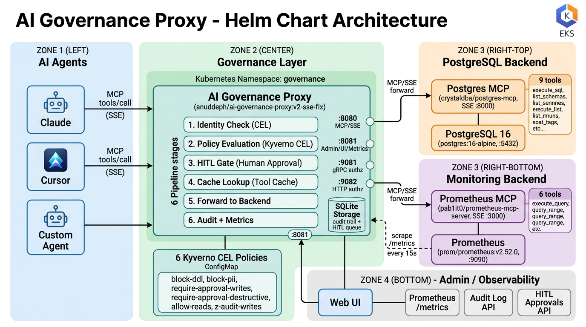

# AI Governance Proxy — Helm Chart

Helm chart that deploys the [Nirmata AI Governance Proxy](https://github.com/nirmata/ai-governance-proxy) with MCP backend datasources (PostgreSQL, Prometheus) and Kyverno CEL policies. **Use one chart for two test profiles:** default values for **MCP tool-call governance**, and `values-authz.yml` for **LiteLLM authorization** (`POST /authz/litellm` on the admin plane).

## Values files (which file to use)

| File | `proxy.mode` | Use it to test |
|------|----------------|----------------|
| **`values.yaml`** (default) | `standalone` | **MCP** — agents connect to the proxy on `:8080`; policies govern `tools/call` to Postgres/Prometheus MCP backends. |
| **`values-authz.yml`** | `authz-provider` | **LiteLLM** — proxy validates identity tokens and evaluates LiteLLM-oriented policies on inference-style requests; MCP backends stay enabled so you can still exercise tool governance. |

From the **repository root**, Helm loads the chart’s bundled `governance-helm/values.yaml` automatically — that is the **MCP** profile (`proxy.mode: standalone`). You can omit `-f` or pass it explicitly:

```bash
helm install governance ./governance-helm -n governance
# equivalent explicit file:
# helm install governance ./governance-helm -n governance -f governance-helm/values.yaml
```

For **LiteLLM** testing, merge the authz profile (same content as the former `governance-litellm-helm` chart values) on top of the chart:

```bash
helm install governance ./governance-helm -n governance -f governance-helm/values-authz.yml
```

Layer your own overrides last: `helm install ... -f governance-helm/values-authz.yml -f my-overrides.yaml`.

If your shell’s current directory is **`governance-helm/`**, use `helm install governance . -n governance -f values.yaml` or `-f values-authz.yml`.

## What This Chart Does

This chart packages a governance layer for AI agents that use the **Model Context Protocol (MCP)**. In the default profile, it sits between AI agents and MCP tool servers, intercepting every `tools/call` request and enforcing Kyverno CEL policies before the call reaches the backend.

With **`values-authz.yml`**, the proxy additionally acts as a **LiteLLM authorization backend**: LiteLLM’s custom auth hook calls the governance proxy’s authz endpoint so Kyverno CEL policies apply to LLM gateway traffic (while MCP datasources remain available for policy context and testing).

The proxy provides:

- **Policy enforcement** — Kyverno CEL expressions evaluate every tool call in real-time
- **Human-in-the-loop (HITL)** — Write operations are held pending human approval
- **Audit trail** — Every tool call is logged with agent ID, tool name, decision, policy, and latency
- **Tool response caching** — Repeated read queries are served from cache
- **PII protection** — Queries referencing sensitive columns (ssn, credit_card, password, secret) are blocked
- **DDL protection** — Schema-modifying operations (CREATE, DROP, ALTER, TRUNCATE) are unconditionally blocked
- **Prometheus metrics** — Full observability via `/metrics` endpoint
- **Web UI** — Admin console for policies, audit log, approvals, and health monitoring

## Architecture

```
┌──────────────┐      MCP/SSE        ┌─────────────────────────┐     MCP/SSE      ┌───────────────┐
│   AI Agent   │ ──────────────────▶  │  AI Governance Proxy    │ ──────────────▶   │  Postgres MCP │
│  (Claude,    │  tools/call          │                         │  tools/call       │  (SSE server) │
│   Cursor,    │  ◀──────────────────  │  1. Identity check      │  ◀──────────────  │               │
│   etc.)      │  result / error      │  2. Policy evaluation   │  result           └───────┬───────┘
└──────────────┘                      │  3. HITL gate           │                          │
                                      │  4. Cache lookup        │                   ┌───────▼───────┐
                                      │  5. Forward to backend  │                   │  PostgreSQL   │
                                      │  6. Audit + metrics     │                   │  (data store) │
                                      └─────────────────────────┘                   └───────────────┘
                                        :8080 MCP    :8081 Admin
                                        :9081 gRPC   :9082 HTTP authz
```




**LiteLLM + `values-authz.yml` (authz-provider):** the same proxy and pipeline apply; additionally **LiteLLM** (namespace `litellm`) calls **`POST /authz/litellm`** on **:8081** with identity tokens (**Azure AD** OIDC). See the combined diagram: [`architecture-litellm-authz.png`](architecture-litellm-authz.png) (source Mermaid: [`../diagrams/05-full-stack-litellm-governance.mmd`](../diagrams/05-full-stack-litellm-governance.mmd)).

**Data flow:** AI agents connect via MCP/SSE to the governance proxy (:8080). Every `tools/call` passes through a 6-stage pipeline (identity → policy → HITL → cache → forward → audit). Allowed calls are forwarded to backend MCP servers (Postgres MCP, Prometheus MCP) over SSE. Prometheus scrapes the proxy's `/metrics` endpoint every 15s. The admin UI, audit log, and HITL approvals are served on :8081.

## Components

### 1. AI Governance Proxy (`proxy-deployment.yaml`)

The core component. A Go binary that implements an MCP SSE server on port 8080 and an admin/UI server on port 8081.

| Port | Protocol | Purpose |
|------|----------|---------|
| 8080 | HTTP/SSE | MCP endpoint — agents connect here |
| 8081 | HTTP | Admin API, Web UI, Prometheus metrics, health checks |
| 9081 | gRPC | External authorization (Envoy ext_authz compatible) |
| 9082 | HTTP | HTTP authorization endpoint |

**What it does:**
- Receives MCP `tools/call` requests from AI agents
- Resolves the datasource via the `name__tool` prefix pattern (e.g., `postgres__execute_sql` routes to the postgres datasource with bare tool name `execute_sql`)
- Validates agent identity (OIDC or CEL passthrough)
- Evaluates all matching Kyverno CEL policies against the tool call
- Enforces the policy decision: allow, deny, audit, warn, or require-approval (HITL)
- Caches tool responses for configured tools/TTLs
- Forwards allowed calls to the backend MCP server
- Records audit events to SQLite storage
- Exposes Prometheus metrics for every stage of the pipeline

### 2. PostgreSQL Database (`postgres.yaml` — Deployment + Service)

A `postgres:16-alpine` instance that serves as the application database for MCP tool calls.

- Stores the actual data that AI agents query through the MCP tools
- Runs with persistent storage (5Gi PVC by default)
- Seeded with test data (employees table with PII columns for policy testing)

### 3. Postgres MCP Server (`postgres.yaml` — Deployment + Service)

A `crystaldba/postgres-mcp` instance running in **SSE transport mode** that exposes PostgreSQL operations as MCP tools.

**9 tools exposed:**

| Tool | Description |
|------|-------------|
| `list_schemas` | List all database schemas |
| `list_objects` | List tables, views, sequences in a schema |
| `get_object_details` | Show columns, indexes, constraints for a table |
| `explain_query` | EXPLAIN plan with cost estimates |
| `analyze_workload_indexes` | Recommend indexes for frequent queries |
| `analyze_query_indexes` | Recommend indexes for specific SQL queries |
| `analyze_db_health` | Check indexes, connections, vacuum, replication health |
| `get_top_queries` | Report slowest queries from pg_stat_statements |
| `execute_sql` | Execute any SQL query |

### 4. Kyverno CEL Policies (`proxy-configmap.yaml` — policies ConfigMap)

Six policies mounted at `/etc/proxy/policies/` inside the proxy container:

| Policy | Mode | What It Does |
|--------|------|-------------|
| `block-ddl` | deny | Blocks CREATE, DROP, ALTER, TRUNCATE operations unconditionally |
| `block-pii-access` | deny | Blocks queries referencing ssn, credit_card, password, secret columns |
| `require-approval-destructive` | fail | Requires HITL approval for tools matching delete/drop/truncate/rm/destroy |
| `require-approval-writes` | require-approval | Holds INSERT/UPDATE/DELETE in the HITL queue pending human approval |
| `z-audit-writes` | audit | Logs all write operations (allow but record) |
| `allow-reads` | allow | Explicitly allows SELECT queries |

**Policy evaluation order matters** — policies are loaded alphabetically by filename. The `z-audit-writes` is prefixed with `z-` so it loads after `require-approval-writes`, ensuring writes go to the HITL queue first.

When you install with **`values-authz.yml`**, the ConfigMap also includes **LiteLLM authz** policies (e.g. `litellm-require-identity`, `litellm-restrict-models`, `litellm-audit-all`) in addition to the MCP policies above.

### 5. Optional Components

- **Prometheus + Prometheus MCP** (`prometheus.yaml`) — When enabled, deploys a Prometheus server that scrapes the governance proxy's `/metrics` endpoint and a Prometheus MCP bridge that exposes `query` and `query_range` as MCP tools for AI agents.
- **Presidio** (`presidio.yaml`) — Disabled by default. Microsoft Presidio PII analyzer for content-level PII detection.

### 6. SSE Connection Resilience (forwarder.go fix)

The proxy maintains a pool of persistent SSE connections to backend MCP servers. The `crystaldba/postgres-mcp` backend can close its SSE stream after responses, causing the proxy's pooled client to become stale. The `fix/sse-client-evict-retry` branch adds:

- **15s stale detection timeout** — first call attempt uses a short timeout; if the connection is dead, failure is detected in 15s instead of the mcp-go default of 60s
- **Compare-and-swap eviction** — only the specific stale client is removed from the pool, preventing race conditions under concurrent tool calls
- **Automatic reconnect and retry** — a fresh SSE client is created and the tool call is retried transparently

See [ISSUES.md](ISSUES.md) for the full debugging story (Issues 7 and 13).

## Prerequisites

- Kubernetes cluster (EKS, GKE, AKS, or Kind)
- Helm 3.x
- `kubectl` configured for your cluster
- A default StorageClass (for PVCs) — on AWS EKS, create a `gp3` StorageClass if none exists

## Installation

### Quick Start (MCP — default `values.yaml`)

```bash
# Create namespace
kubectl create namespace governance

# Install with chart defaults (standalone MCP governance; values.yaml is loaded automatically)
helm install governance ./governance-helm -n governance

# Wait for pods
kubectl get pods -n governance -w

# Port-forward for local access
kubectl port-forward svc/ai-governance-proxy 8080:8080 8081:8081 -n governance
```

### LiteLLM authz profile (`values-authz.yml`)

Use this when testing the proxy as LiteLLM’s authz provider (OIDC identity validation and LiteLLM-specific Kyverno policies). From the repo root:

```bash
helm install governance ./governance-helm -n governance -f governance-helm/values-authz.yml
```

Port-forward MCP and admin ports as above; point LiteLLM at the proxy’s authz listeners (`proxy.authzAddr`, `proxy.httpAuthzAddr`, and `proxy.service.authzGrpcPort` / `authzHttpPort` in `values-authz.yml`).

### Verify Installation

```bash
# Health check
curl http://localhost:8081/healthz

# Open Web UI
open http://localhost:8081/ui
# Login: admin / admin123
```

### Seed Test Data

```bash
kubectl exec -n governance deployment/postgres -- psql -U appuser -d appdb -c "
CREATE TABLE IF NOT EXISTS employees (
  id SERIAL PRIMARY KEY,
  name VARCHAR(100) NOT NULL,
  email VARCHAR(100),
  department VARCHAR(50),
  salary NUMERIC(10,2),
  ssn VARCHAR(11),
  credit_card VARCHAR(20),
  created_at TIMESTAMP DEFAULT NOW()
);

INSERT INTO employees (name, email, department, salary, ssn, credit_card) VALUES
  ('Alice Johnson', 'alice@example.com', 'Engineering', 120000, '123-45-6789', '4111111111111111'),
  ('Bob Smith', 'bob@example.com', 'Engineering', 115000, '234-56-7890', '5500000000000004'),
  ('Carol Davis', 'carol@example.com', 'Product', 130000, '345-67-8901', '340000000000009');
"
```

### Run Tests

```bash
chmod +x governance-helm/test-governance.sh
./governance-helm/test-governance.sh
```

## Configuration

- **`values.yaml`** — Baseline for MCP testing (`proxy.mode: standalone`). OIDC providers are empty by default; tune `identity` and `policies` as needed.
- **`values-authz.yml`** — Full profile for LiteLLM authz testing (`proxy.mode: authz-provider`), including sample Azure AD OIDC and extra LiteLLM-oriented policies (e.g. `litellm-require-identity`, `litellm-restrict-models`, `litellm-audit-all`).

Shared keys (both files):

| Section | Description |
|---------|-------------|
| `proxy` | Proxy image, mode (`standalone` \| `sidecar` \| `authz-provider`), resources, service ports |
| `identity` | Authentication mode (oidc/cel), anonymous access, OIDC providers |
| `policy` | Policy engine settings, fail-open behavior, cache TTL |
| `hitl` | Human-in-the-loop timeout, session affinity, timeout action |
| `toolCache` | Tool response caching, max entries, per-tool TTL configuration |
| `audit` | Audit buffer size, flush interval, batch size |
| `storage` | SQLite persistence for audit trail and approvals |
| `ui` | Web UI toggle and admin password (bcrypt hash) |
| `postgres` | PostgreSQL database and MCP server configuration |
| `policies` | Inline Kyverno CEL policy definitions |

### Changing the Admin Password

Generate a bcrypt hash using Go:

```bash
go run -e 'import "golang.org/x/crypto/bcrypt"; h, _ := bcrypt.GenerateFromPassword([]byte("your-password"), 10); println(string(h))'
```

Or use `htpasswd`:

```bash
htpasswd -nbBC 10 "" "your-password" | cut -d: -f2
```

Update `ui.passwordHash` in `values.yaml` with the generated hash.

### Adding Custom Policies

Add entries under the `policies` key in the values file you use (`values.yaml` or `values-authz.yml`). Each key is a filename, and the value is the full Kyverno ValidatingPolicy YAML:

```yaml
policies:
  my-custom-policy.yaml: |
    apiVersion: policies.kyverno.io/v1alpha1
    kind: ValidatingPolicy
    metadata:
      name: my-custom-policy
      annotations:
        proxy.nirmata.io/enforcement-mode: deny
    spec:
      evaluation:
        mode: JSON
      matchConditions:
        - name: match-condition
          expression: >
            object.tool.name == "some_tool"
      validations:
        - expression: "false"
          message: "This tool is blocked"
```

### Policy CEL Context

Policies have access to these CEL variables:

| Variable | Type | Description |
|----------|------|-------------|
| `object.tool.name` | string | Bare tool name (prefix stripped) |
| `object.tool.arguments` | map | Tool call arguments |
| `object.tool.targetURL` | string | Backend MCP server URL |
| `object.agent.agentId` | string | Agent identifier |
| `object.agent.namespace` | string | Kubernetes namespace |
| `object.agent.capabilities` | list | Agent capabilities |
| `object.agent.labels` | map | Agent labels |
| `object.user.userId` | string | Delegating user ID |
| `object.user.email` | string | User email |
| `object.user.groups` | list | User groups |
| `object.user.roles` | list | User roles |

### Enforcement Modes

Set via the `proxy.nirmata.io/enforcement-mode` annotation:

| Mode | Behavior |
|------|----------|
| `deny` | Block the request immediately (default when no annotation) |
| `allow` | Permit the request |
| `audit` | Permit but record a policy violation |
| `warn` | Permit but surface a warning |
| `require-approval` | Hold the request pending human approval via the HITL queue |

## Admin API Endpoints

| Method | Path | Description |
|--------|------|-------------|
| POST | `/api/v1/ui/login` | Authenticate and get JWT token |
| GET | `/api/v1/policies` | List loaded policies |
| GET | `/api/v1/datasources` | List datasources and their tools |
| GET | `/api/v1/audit/events` | Query audit trail |
| GET | `/api/v1/approvals` | List pending HITL approvals |
| POST | `/api/v1/approvals/{id}/decision` | Approve or deny a pending request (`{"decision":"allow"}` or `{"decision":"deny"}`) |
| GET | `/api/v1/health/components` | Component-level health status |
| GET | `/healthz` | Liveness probe |
| GET | `/readyz` | Readiness probe |
| GET | `/metrics` | Prometheus metrics |

## Known Issues & Fixes

See [ISSUES.md](ISSUES.md) for the complete list of 13 issues encountered during deployment and testing, with root causes and fixes. Key highlights:

| Issue | Impact | Status |
|-------|--------|--------|
| SSE connection goes stale (Issue 7) | Backend calls timeout after initial success | Fixed in `fix/sse-client-evict-retry` branch |
| SSE eviction race condition (Issue 13) | Concurrent tool calls fail after reconnect | Fixed with compare-and-swap eviction |
| Proxy starts before MCP backend (Issue 6) | Tools not loaded at startup | Workaround: restart proxy after backend is ready |
| Policy evaluation order (Issue 11) | Wrong policy wins when multiple match | Fixed by renaming files with `z-` prefix |

## Upgrading

```bash
# MCP profile (chart defaults)
helm upgrade governance ./governance-helm -n governance

# LiteLLM authz profile
helm upgrade governance ./governance-helm -n governance -f governance-helm/values-authz.yml
```

The proxy deployment uses a configmap checksum annotation, so any change to the config or policies triggers an automatic rolling restart.

## Uninstalling

```bash
helm uninstall governance -n governance
kubectl delete pvc --all -n governance  # remove persistent data
kubectl delete namespace governance
```
